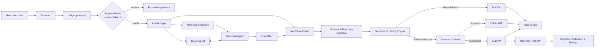
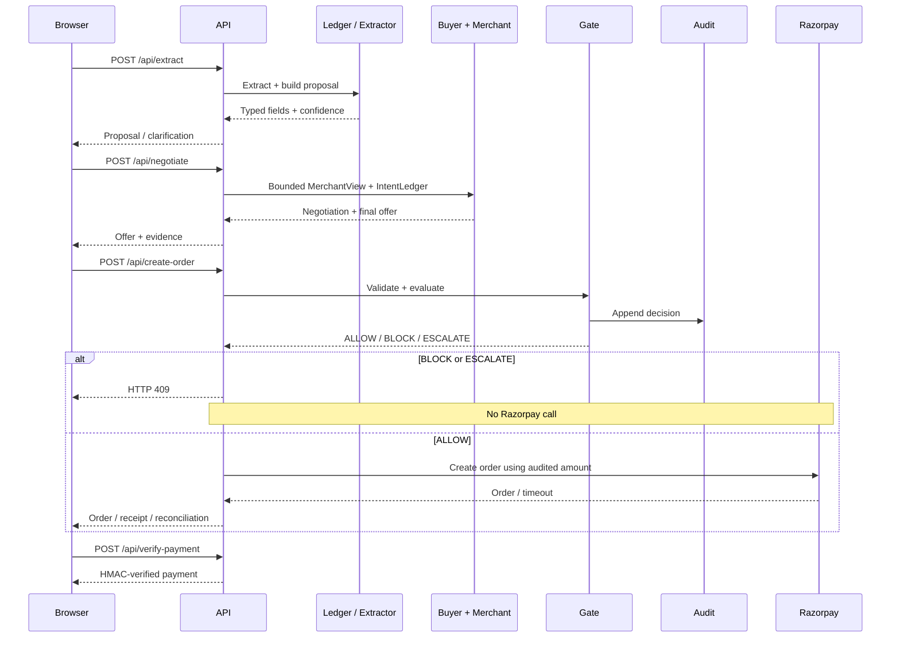

# IntentGuard

> **A deterministic authorization gate for agentic commerce.**

IntentGuard verifies that a merchant's final offer is actually authorized by a user's **AP2 Intent Mandate** before any payment reaches Razorpay.

A payment signature can prove that a user authorized *something*. It does **not** prove that the user authorized **this exact cart**.

IntentGuard closes that gap.

```text
User Intent
     ↓
Buyer Agent ↔ Merchant Agent
     ↓
Final Cart / Offer
     ↓
┌──────────────────────────────┐
│       INTENTGUARD GATE       │
│                              │
│  Deterministic authorization │
└──────────────────────────────┘
        ↓       ↓        ↓
     BLOCK   ESCALATE   ALLOW
        │       │        │
        ↓       ↓        ↓
      Audit   Human    Razorpay
              Review   Test API
```

Built for the **Razorpay AI Buildathon — Track 01: AI Growth & Agentic Commerce**.

---

# The Problem

In agentic commerce, an AI agent can negotiate and assemble a cart on behalf of a user.

The difficult question is not:

> **"Did the user authorize a payment?"**

It is:

> **"Did the user authorize this exact merchant offer?"**

Consider a user saying:

> "Buy me running shoes under ₹5,000, size 9, no leather."

A merchant agent could return:

* ₹4,500 shoes + ₹499 shipping
* a recurring subscription
* an additional warranty
* quantity 2 instead of 1
* a different product
* a product containing leather
* a mismatched total
* a different currency

The user may have authorized the original intent, but **not necessarily the resulting cart**.

IntentGuard therefore treats the merchant's offer and both agents as **untrusted inputs**.

Only the deterministic policy gate can authorize payment.

---

# What IntentGuard Demonstrates

## Three possible outcomes

| Decision     | Meaning                            | Razorpay called? |
| ------------ | ---------------------------------- | ---------------- |
| **ALLOW**    | Offer satisfies the user's mandate | ✅ Yes            |
| **BLOCK**    | A hard constraint is violated      | ❌ No             |
| **ESCALATE** | The system cannot safely decide    | ❌ No             |

Models may help extract structured information from natural language, but **models never make the authorization decision**.

The final decision is computed from:

* integer paise
* enums
* validated schemas
* deterministic rules
* explicit timestamps
* hashes
* persisted state

---

# System Architecture



## The critical trust boundary

The merchant and buyer agents are **outside the trust boundary**.

The trusted path is:

```text
                  UNTRUSTED
┌──────────────────────────────────────┐
│ User instruction                     │
│                                      │
│ Buyer Agent ↔ Merchant Agent         │
│                                      │
│ Final Offer                          │
└──────────────────┬───────────────────┘
                   │
                   ▼
             ┌─────────────┐
             │ INTENTGUARD │  ← TRUSTED
             │    GATE     │
             └──────┬──────┘
                    │
           ┌────────┼────────┐
           ▼        ▼        ▼
        BLOCK   ESCALATE   ALLOW
                             │
                             ▼
                          Razorpay
```

---

# End-to-End Working

## 1. User gives a natural-language instruction

Example:

```text
"Buy me running shoes, size 9, under ₹5,000,
black preferred, no leather."
```

The extractor converts this into a typed `IntentLedger`.

Important properties:

* spending ceiling → integer paise
* category → controlled enum
* quantity → validated value
* exclusions → explicit constraints
* preferences → soft constraints
* confidence → deterministic confidence calculation

A weak or ambiguous mandate cannot reach payment.

---

## 2. Merchant receives a restricted view

The merchant **does not receive the user's spending ceiling**.

The merchant receives an allow-listed `MerchantView` containing things such as:

* category
* quantity
* currency
* authorized obligation types
* product reference
* exclusions
* soft preferences

It does **not** receive:

```text
max_total_paise
raw instruction
confidence
```

This prevents the merchant from simply quoting directly below the user's private ceiling.

---

## 3. Buyer and merchant negotiate

The buyer agent acts for the user.

The merchant agent represents the seller and can deliberately behave badly in the demo.

Examples:

```text
Honest seller
Hidden shipping
Paid add-on
Recurring trial
Product substitution
Quantity inflation
Currency swap
Total mismatch
Excluded material
Prompt injection
Unknown field
```

The negotiation result is still considered **untrusted**.

---

## 4. IntentGuard evaluates the final offer

The final offer passes through:

```text
Schema validation
       ↓
Arithmetic validation
       ↓
Currency validation
       ↓
Quantity validation
       ↓
Recurrence / EMI checks
       ↓
Category / condition checks
       ↓
Product identity checks
       ↓
Exclusion checks
       ↓
Semantic review
       ↓
ALLOW / BLOCK / ESCALATE
```

The merchant cannot bypass this gate.

---

# Decision State Machine


`BLOCK` is recorded as a decision outcome rather than as a separate persisted ledger state.

A blocked offer therefore cannot be executed through the payment adapter.

---

# Runtime Sequence



---

# The Three Decisions

## 🟢 ALLOW

The offer satisfies the user's mandate.

```text
User ceiling:       ₹5,000
Product:            Running shoes
Quantity:           1
Currency:           INR
Final total:        ₹4,599
Excluded material:  Leather
Recurring charge:   None

          ↓

        ALLOW
          ↓
    Audit decision
          ↓
    Razorpay order
```

Only an **`ALLOW`** can reach the payment rail.

---

## 🔴 BLOCK

A deterministic hard constraint is violated.

Example:

```text
User:
"Running shoes under ₹5,000"

Merchant:
Shoes                 ₹4,599
Shipping                ₹499
                        ------
Total                  ₹5,098

          ↓

    TOTAL_EXCEEDS_MAX
          ↓
        BLOCK
          ↓
    No Razorpay call
```

Other hard violations include:

* total mismatch
* wrong currency
* quantity violation
* recurrence
* unauthorized EMI
* paid add-on
* excluded material
* exact product mismatch
* expired mandate

---

## 🟡 ESCALATE

The system encounters uncertainty that should not be silently guessed.

Examples:

```text
Ambiguous spending limit
Unknown category value
Low-confidence extraction
Uncertain product substitution
Unmodelled merchant field
Offer uncertainty
```

The user receives a clarification question.

```text
AWAITING_CONFIRMATION
        ↓
   User confirms
        ↓
       ACTIVE
        ↓
 Re-run complete decision
```

Human confirmation **cannot override a newly discovered hard violation**.

---

# Buyer vs Merchant vs IntentGuard

IntentGuard intentionally separates the trust levels of the system.

| Component          | Trust        | Responsibility                         |
| ------------------ | ------------ | -------------------------------------- |
| **Buyer Agent**    | Untrusted    | Acts for user, searches and negotiates |
| **Merchant Agent** | Untrusted    | Represents seller and produces offer   |
| **IntentGuard**    | Trusted      | Independently validates and authorizes |
| **Razorpay**       | Payment rail | Executes only after `ALLOW`            |

## Buyer Agent

The buyer:

* sees the user's private ceiling
* negotiates toward a lower target
* can make bounded decisions
* cannot authorize payment

## Merchant Agent

The merchant:

* receives an allow-listed mandate projection
* does not receive `max_total_paise`
* can simulate hostile behavior
* cannot determine the final authorization

## IntentGuard

The gate:

* trusts neither agent
* validates the final cart
* checks deterministic constraints
* records the decision
* controls access to Razorpay

---

# Razorpay Integration

IntentGuard is built specifically around the agentic-commerce problem described by the Razorpay AI Buildathon Track 01.

[Razorpay AI Buildathon](https://razorpay.com/buildathon/)

The complete loop is:

```text
User Intent
     ↓
Buyer Agent
     ↓
Merchant Agent
     ↓
Final Cart
     ↓
IntentGuard
     ↓
┌──────────┬────────────┬─────────┐
│  BLOCK   │  ESCALATE  │  ALLOW  │
└──────────┴────────────┴────┬────┘
                              ↓
                       Razorpay Test API
```

The important guarantee is:

```text
BLOCK      → no payment call
ESCALATE   → no payment call
ALLOW      → Razorpay may be called
```

The create-order endpoint does **not accept an arbitrary amount from the browser**.

The payment amount is derived from the audited, checked amount.

---

# Auditability

Every authorization decision creates an `AuditRecord` containing:

* mandate hash
* offer hash
* checked amount
* spending ceiling
* violations
* latency
* engine version
* human-confirmation status

Records form a tamper-evident chain:

```text
Record 1
   │
   └── hash
       ↓
Record 2
   │
   └── hash
       ↓
Record 3
   │
   └── hash
       ↓
Record 4
```

Conceptually:

```text
record_hash_n =
    SHA256(canonical_json(record_n))

record_n.previous_hash =
    record_hash_(n-1)
```

Editing an earlier record breaks the chain from that point onward.

An `ALLOW` can also produce a `ComplianceReceipt` containing the exact:

* mandate hash
* offer hash
* authorized amount
* checked constraints
* decision metadata

---

# Safety Invariants

IntentGuard is designed around explicit security invariants:

* All money values are integer INR paise.
* No currency conversion is performed.
* The merchant never receives `max_total_paise`.
* A payment call occurs only after `ALLOW`.
* Mandates are single-use.
* Unknown or ambiguous values escalate rather than being guessed.
* Razorpay live keys are rejected.
* The policy engine does not import model or payment code.
* Payment amount comes from the audited decision, not the browser.
* Payment timeouts become `EXECUTION_UNCERTAIN`.
* Blind payment retries are avoided.
* Payment signatures are verified using HMAC-SHA256 with constant-time comparison.

---

# Hostile Merchant Demonstrations

The demo intentionally allows the merchant to behave adversarially.

| Merchant behavior    | Example mutation                  | Expected handling                            |
| -------------------- | --------------------------------- | -------------------------------------------- |
| Honest seller        | Normal valid offer                | `ALLOW`                                      |
| Hidden shipping      | Adds ₹499 shipping                | `BLOCK` if ceiling exceeded                  |
| Paid add-on          | Adds ₹799 warranty                | `BLOCK`                                      |
| Recurring trial      | Adds ₹299/month renewal           | `BLOCK`                                      |
| Quantity inflation   | Adds one extra item               | `BLOCK`                                      |
| Currency swap        | INR → USD                         | `BLOCK`                                      |
| Total mismatch       | Declared total differs from lines | `BLOCK`                                      |
| Excluded material    | Adds prohibited material          | `BLOCK`                                      |
| Product substitution | Different product                 | `BLOCK` / `ESCALATE` depending on constraint |
| Prompt injection     | Malicious listing instructions    | Ignored by authorization logic               |
| Unknown field        | Adds unmodelled obligation        | `ESCALATE`                                   |

The selected merchant behavior is **not itself the verdict**.

The resulting offer is evaluated by the same policy engine every time.

---

# Algorithms

## Final amount

For line items:

```text
line_sum = Σ line.amount_paise

TOTAL_MISMATCH
    if offer.total_paise != line_sum
```

For non-EMI:

```text
checked_total = offer.total_paise
```

For EMI:

```text
checked_total =
    max(
        offer.total_paise,
        emi.installment_paise * emi.installment_count
    )
```

Budget violation:

```text
TOTAL_EXCEEDS_MAX
    if checked_total > max_total_paise
```

---

## Extraction Confidence

Confidence is computed as:

```text
confidence = clamp(1.0 - penalties, 0, 1)
```

Signals include:

| Signal                       | Penalty |
| ---------------------------- | ------: |
| Missing ceiling              |    1.00 |
| No bound word                |    0.25 |
| Vague language near amount   |    0.55 |
| Unmarked multi-item quantity |    0.45 |
| Hedged quantity              |    0.50 |
| Competing monetary amounts   |    0.60 |

A low-confidence mandate becomes `AWAITING_CONFIRMATION`.

---

## Catalog Retrieval

Catalog retrieval is deliberately separate from authorization.

The merchant can use:

1. **BM25**
2. **Character-trigram coverage**
3. **Optional dense embeddings**

BM25:

```text
k1 = 1.5
b  = 0.75
```

Character trigram retrieval requires at least:

```text
50% query-trigram coverage
```

The lexical rankings are combined using Reciprocal Rank Fusion:

```text
RRF(item) =
    Σ 1 / (60 + rank_arm(item))
```

Optional Bedrock embeddings use:

```text
amazon.titan-embed-text-v2:0
```

with the configured dense similarity floor.

Retrieval can suggest a product.

**It cannot authorize payment.**

---

## Buyer Negotiation

The buyer's target is intentionally below the user's ceiling:

```text
target_paise =
    floor(max_total_paise * target_bps / 10,000)
```

Default:

```text
target_bps = 9,000
target = 90% of ceiling
```

For the default `haggle` mode:

```text
gap = quoted_total - target_paise

conceded = floor(gap / 10)

revised_product_price =
    max(0, previous_product_price - conceded)
```

Negotiation stops after:

* concession below ₹1
* or 6 rounds

Negotiation is an optimization step.

**It is never the authorization step.**

---

# Decision Precedence

If multiple violations exist, the system follows:

```text
if any BLOCK:
    BLOCK

else if any ESCALATE:
    ESCALATE

else:
    ALLOW
```

This prevents a soft uncertainty from hiding a hard violation.

---

# Metrics & Benchmarking

Gold and synthetic datasets are evaluated separately.

Core classification metrics:

```text
accuracy
precision
recall
F1
macro_F1
```

Safety and commerce metrics include:

```text
authorized_completion_rate
false_block_rate
value_wrongly_blocked_paise
unauthorized_pass_rate
exposure_prevented_paise
exposure_leaked_paise
escalation_rate
escalation_recall
```

Runtime monitoring exposes:

```text
/api/metrics
```

Important production signals include:

* `ALLOW / BLOCK / ESCALATE` distribution
* false-block rate
* unauthorized pass rate
* p50 / p95 / p99 latency
* violations by code
* audit-chain verification
* `EXECUTION_UNCERTAIN` count
* merchant projection ceiling exposure

---

# Why This Matters for Agentic Commerce

IntentGuard's core proposition is:

> **Agents can negotiate freely, but they cannot move money freely.**

The agents are allowed to:

```text
search
negotiate
propose
adapt
```

But the payment rail only sees:

```text
an independently validated
and auditable authorization decision
```

That creates a clean separation between:

```text
AI interpretation
        ↓
AI negotiation
        ↓
deterministic authorization
        ↓
payment execution
```

The result is an agentic-commerce flow where **the merchant can be untrusted, the AI can be probabilistic, and the payment boundary can still remain deterministic.**

---

# Full Flow

```text
                 USER
                  │
                  ▼
         Natural-language intent
                  │
                  ▼
              EXTRACTION
                  │
                  ▼
             IntentLedger
                  │
         ┌────────┴─────────┐
         ▼                  ▼
   Buyer Agent         Merchant Agent
         │                  │
         └────────┬─────────┘
                  ▼
             Final Offer
                  │
                  ▼
          ┌───────────────┐
          │  INTENTGUARD  │
          │     GATE      │
          └───────┬───────┘
                  │
         ┌────────┼────────┐
         ▼        ▼        ▼
      BLOCK   ESCALATE   ALLOW
         │        │        │
         ▼        ▼        ▼
       Audit    Human     Audit
                review      │
                             ▼
                       Razorpay Test API
                             │
                             ▼
                     Payment Verification
                             │
                             ▼
                    Compliance Receipt
```

**The key invariant:**

```text
No ALLOW
   =
No Razorpay payment call
```

---

# Demo Checkout

The browser demo is a React/Vite frontend backed by the real API.

It demonstrates:

```text
Extraction
   ↓
Negotiation
   ↓
Deterministic evaluation
   ↓
Audit logging
   ↓
ALLOW / BLOCK / ESCALATE
   ↓
Razorpay test-mode checkout
   ↓
Payment verification
```

It does not use fixture responses.

---

# Project Structure

| Package              | Responsibility                                           |
| -------------------- | -------------------------------------------------------- |
| `core`               | Schemas, integer-money helpers, hashing, violation codes |
| `ledger`             | Extraction, confidence, mandate construction, TTL        |
| `policy`             | Deterministic authorization checks                       |
| `merchant` / `buyer` | Merchant behavior and buyer negotiation                  |
| `semantic`           | Product substitution and preference drift                |
| `gate`               | Trust boundary, decisions, escalation, audit writes      |
| `payments`           | Razorpay adapter, receipts, idempotency                  |
| `audit` / `metrics`  | Verifiable records and reporting                         |
| `bench`              | Dataset generation and benchmarking                      |

---

# Project Setup

Requires:

* Python 3.11+
* `uv`

```bash
uv venv --python 3.12 .venv
uv pip install -e ".[dev]"
.venv/bin/python -m pytest
```

Run the backend:

```bash
PYTHONPATH=src .venv/bin/python -m uvicorn \
  intentguard.api.app:create_app --factory --port 8000
```

Open:

```text
http://127.0.0.1:8000
```

Without the built frontend, the API serves the fallback checkout page.

---

# Razorpay Test Checkout Setup

Razorpay checkout requires test credentials.

Copy:

```text
.env.example → .env
```

and configure:

```dotenv
RAZORPAY_KEY_ID=rzp_test_...
RAZORPAY_KEY_SECRET=...
```

Live keys are rejected at startup.

The secret remains server-side; only the public key ID is exposed to the browser.

The project is **test-mode only**.

---

# Frontend Development

```bash
cd web
npm install
npm run build
cd ..
```

Start the backend:

```bash
PYTHONPATH=src .venv/bin/python -m uvicorn \
  intentguard.api.app:create_app --factory --port 8000
```

For frontend development:

```bash
cd web
npm run dev
```

Vite proxies `/api` to the backend.

---

# Development Commands

Run tests:

```bash
.venv/bin/python -m pytest
```

Run linting:

```bash
.venv/bin/python -m ruff check .
```

Rebuild benchmark datasets:

```bash
.venv/bin/python data/gold/author.py
.venv/bin/python data/dev/author.py
.venv/bin/python data/dev/substitutions.py
```

Run benchmark:

```bash
PYTHONPATH=src .venv/bin/python -m intentguard.bench.generator
PYTHONPATH=src .venv/bin/python -m intentguard.bench.harness
PYTHONPATH=src .venv/bin/python -m intentguard.bench.export
```

---

# Optional Bedrock Extraction / Retrieval

The system works without model credentials using deterministic rule-based extraction.

Optional Bedrock support:

```bash
uv pip install -e ".[bedrock]"
```

Model-backed components remain advisory.

They cannot:

* emit an authorization decision
* invent a SKU
* set a price
* authorize a payment

---

# Testing

The test suite covers:

* schema rules
* policy violations
* import boundaries
* hostile merchant input
* negotiation termination
* extraction calibration
* escalation
* audit integrity
* payment failure paths
* API boundaries

The architectural boundary is enforced so the policy package remains independent from model and payment code.

---

# Scope & Limitations

IntentGuard is intentionally:

* INR-only
* single-currency
* single-use mandate based

The buyer agent can infer the spending ceiling from negotiation behavior, although it negotiates toward a target below the ceiling.

Fraud detection is out of scope. Suspiciously low prices are treated as drift rather than being blocked solely because they are low.

---

# Built for the Razorpay AI Buildathon

IntentGuard demonstrates a complete agentic-commerce authorization loop:

```text
User Intent
     ↓
AI Buyer
     ↓
AI Merchant
     ↓
Negotiated Offer
     ↓
Deterministic Authorization
     ↓
BLOCK / ESCALATE / ALLOW
     ↓
Razorpay Test Payment
     ↓
Verification + Compliance Receipt
```

The core design principle is simple:

> **AI can interpret and negotiate.
> Deterministic policy decides whether money may move.**
