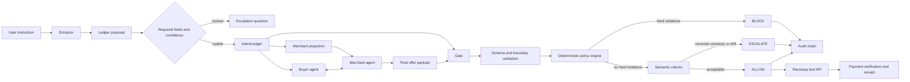
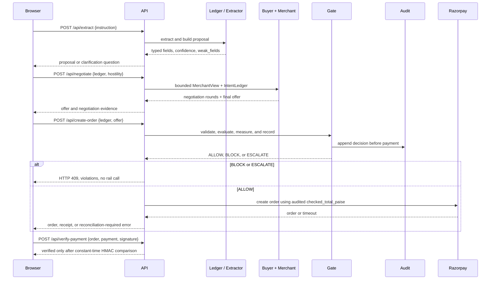
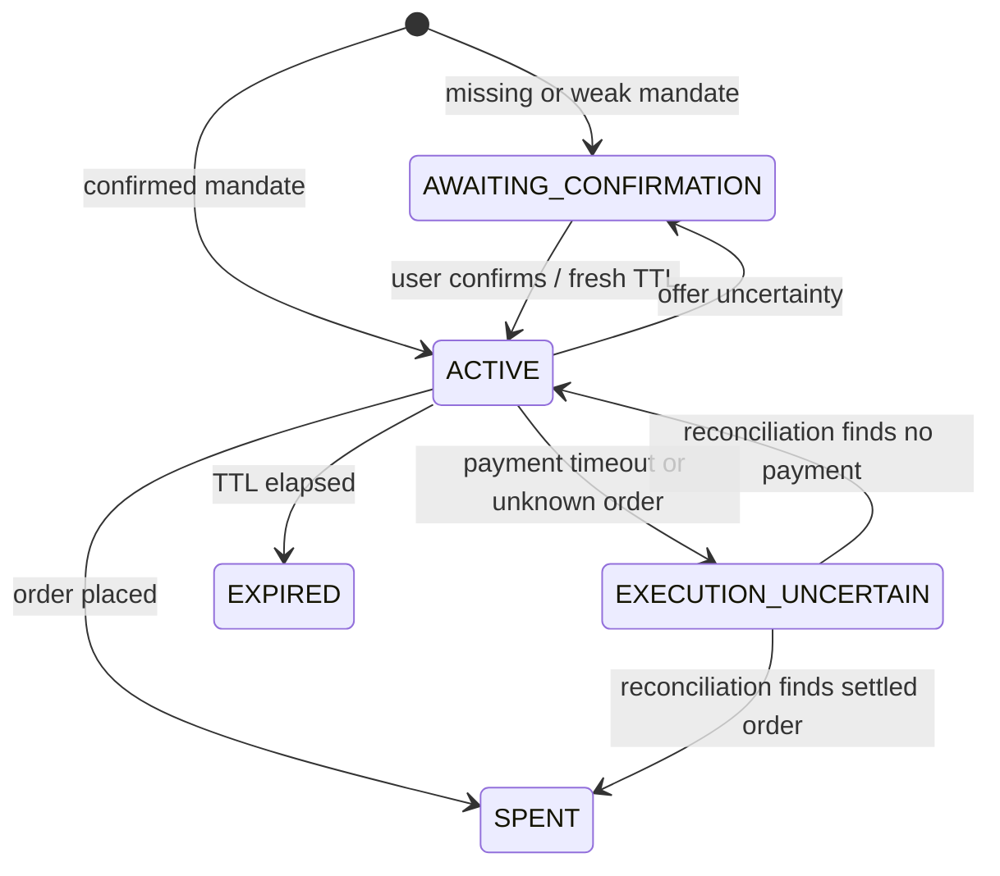

# IntentGuard

IntentGuard is a deterministic authorization gate for agentic commerce. It evaluates whether a merchant's offer satisfies a user's AP2 Intent Mandate before the payment rail is reached.

The core problem is simple: verifying a signature proves that a user authorized *something*; it does not prove that *this cart* is authorized. IntentGuard closes that gap with three outcomes:

- `ALLOW`: the offer satisfies the mandate and may reach Razorpay.
- `BLOCK`: one or more constraints are violated; no payment call is made.
- `ESCALATE`: the system cannot decide with confidence and asks for clarification.

Models may extract structured fields from natural language, but they never produce the decision. The policy engine evaluates integer paise, enums, and validated schemas.

Built for the Razorpay AI Buildathon, Track 01.

## What it demonstrates

- Rule-based mandate extraction with optional Amazon Bedrock extraction.
- A buyer agent and an untrusted merchant agent negotiating an offer.
- Deterministic checks for amount, currency, quantity, category, condition, recurrence, EMI, add-ons, substitutions, expiry, and malformed data.
- A gate that records every decision in a tamper-evident audit log.
- Razorpay Standard Checkout in test mode, reachable only after `ALLOW`.
- Escalation, uncertain execution, payment signature verification, and compliance receipts.
- Gold and synthetic benchmark datasets with separate reporting.

## Quick start

Requires Python 3.11+ and [uv](https://docs.astral.sh/uv/).

```bash
uv venv --python 3.12 .venv
uv pip install -e ".[dev]"
.venv/bin/python -m pytest
```

Run the backend without credentials. The rule-based extractor and test suite do not make network calls:

```bash
PYTHONPATH=src .venv/bin/python -m uvicorn \
  intentguard.api.app:create_app --factory --port 8000
```

Open <http://127.0.0.1:8000>. Without a built frontend, the API serves the fallback checkout page.

## Demo checkout

The browser demo is a React/Vite app backed by the real API. It runs extraction, negotiation, deterministic evaluation, audit logging, and Razorpay test-mode checkout; it does not use fixture responses.

```bash
cd web
npm install
npm run build
cd ..
PYTHONPATH=src .venv/bin/python -m uvicorn \
  intentguard.api.app:create_app --factory --port 8000
```

For frontend development, start the backend on port 8000 and run `npm run dev` in `web/`. Vite proxies `/api` to the backend.

Razorpay checkout requires test credentials. Copy `.env.example` to `.env` and set:

```dotenv
RAZORPAY_KEY_ID=rzp_test_...
RAZORPAY_KEY_SECRET=...
```

Live keys are rejected at startup. The secret stays server-side; only the public key id is returned to the browser. Razorpay's test card is `4100 2800 0000 1007`, CVV `123`, expiry `12/26`. Test UPI is `test@razorpay`.

## Request flow

1. `/api/extract` turns a natural-language instruction into a proposed mandate and reports the extraction backend, confidence, and weak fields.
2. `/api/negotiate` gives the merchant a bounded view of the mandate and runs the buyer and merchant agents.
3. `/api/create-order` validates the mandate and offer, runs the gate, writes an audit record, and only then creates a Razorpay order using the judged total.
4. `/api/verify-payment` verifies Razorpay's HMAC signature before a payment is treated as made.

The create-order request has no amount field. The caller cannot bypass the gate by choosing a different charge amount. `BLOCK` and `ESCALATE` return HTTP 409 and do not call Razorpay.

## Architecture

```text
Natural-language instruction
             |
     ledger / extraction
             |
  buyer <-> merchant negotiation
             |
       gate / policy engine
        |       |       |
     BLOCK  ESCALATE  ALLOW
        |       |       |
      audit   human   Razorpay test API
```

| Package | Responsibility |
|---|---|
| `core` | Schemas, integer-money helpers, hashing, and violation codes |
| `ledger` | Extraction, confidence, mandate construction, and TTL handling |
| `policy` | Deterministic authorization checks; isolated from model and payment code |
| `merchant` / `buyer` | Untrusted merchant behavior and bounded buyer negotiation |
| `semantic` | Product substitution and preference drift signals |
| `gate` | Trust boundary, decision assembly, escalation, and audit writes |
| `payments` | Razorpay adapter, receipts, idempotency, and uncertain execution |
| `audit` / `metrics` | Verifiable records, rendering, and benchmark reporting |
| `bench` | Independent generator, harness, exports, and dashboard data |

## Internal processing

IntentGuard separates **interpretation** from **authorization**. Natural language and merchant payloads are untrusted inputs. They are converted into typed records at the boundary, then the authorization decision is computed from integers, enums, hashes, and an injected timestamp.

### System data flow



The merchant and buyer agents are deliberately separate from the trusted gate. The merchant receives an allow-listed projection without the spending ceiling. The buyer can see the ceiling because it acts for the user, but negotiation is bounded and the resulting cart is still treated as untrusted when it reaches the gate.

### Runtime sequence



### Processing stages and data contracts

#### 1. Instruction to mandate

`POST /api/extract` produces an `ExtractedIntent`, then `ledger.build.build_ledger()` creates a proposed `IntentLedger`.

- Amounts are parsed into integer paise. Floating-point values never enter the money path.
- An explicit per-unit limit is multiplied by quantity. An unmarked multi-item budget is ambiguous and becomes a question.
- Required fields are the spending ceiling and controlled product category.
- Confidence is derived from the instruction: vague terms, missing bounds, competing amounts, and hedged quantities reduce confidence.
- A weak proposal is `AWAITING_CONFIRMATION`; it cannot reach payment.

The model, when configured, only fills the extraction schema. It has no decision field and cannot emit `ALLOW`, `BLOCK`, or `ESCALATE` as an authorization result.

#### 2. Information-minimized merchant view

`merchant.projection.project()` constructs `MerchantView` by explicitly naming fields the merchant may see. It includes category, quantity, currency, authorized obligation types, product reference, exclusions, and soft preferences.

It excludes `max_total_paise`, raw instruction text, and confidence. This prevents a merchant from quoting directly below the user's ceiling or extracting that ceiling from prose. The projection is an allow-list, so newly added mandate fields remain private until deliberately exposed.

#### 3. Hybrid catalog retrieval

Catalog selection is a retrieval problem, not a payment-decision problem. The merchant searches the in-memory `CATALOG` after deterministic category and condition filtering. It never filters by the user's spending ceiling because that value is intentionally absent from `MerchantView`.

For a named product, `merchant.search.search()` creates one searchable document per catalog item with `document_for()`. Each document contains the title, brand, colour, SKU, controlled category, category synonyms, and materials. The query is normalized by `tokenise()` and generic category words are removed by `distinctive()` so a request for a product type such as “running shoes” does not become a false exact product identity.

The default retrieval path has two lexical arms:

1. **BM25** ranks exact terms using term frequency, inverse document frequency, and document-length normalization. The implementation uses Okapi-style parameters `k1 = 1.5` and `b = 0.75`. Rare identifiers such as `T480`, `Airdopes`, or `Gel-Contend` receive more weight than common terms.
2. **Character-trigram coverage** breaks the normalized query and document into three-character windows. A document is a candidate when it covers at least 50% of the query trigrams. This handles spelling and formatting variation such as `earphone`/`earphones`, `boat`/`boAt`, and `mac book`/`macbook`.

The two rankings do not share a comparable numeric score, so they are combined with **Reciprocal Rank Fusion (RRF)** rather than by adding BM25 and trigram scores:

```text
RRF(item) = sum over retrieval arms of 1 / (k + rank(item))
```

The implementation uses `k = 60`. A product receives a contribution only from an arm that returned it; being absent from one ranking is not treated as a negative score. `fuse()` returns both the fused score and the individual arm ranks for inspection.

When Bedrock credentials are available, `api._retrieval()` adds an optional dense arm through `BedrockEmbeddings`. The default model is `amazon.titan-embed-text-v2:0`. Catalog documents are embedded once per process by `warm()`, query/document vectors are cached, and vectors are normalized before comparison. Retrieval then uses the dot product of normalized vectors as cosine similarity and keeps candidates above the configured dense floor of `0.21`.

The dense arm is additive, not authoritative. If embedding calls fail, the dense ranking is empty and BM25 plus trigrams continue to work. This makes semantic retrieval an availability enhancement rather than a dependency for checkout.

Each fused hit is marked `grounded` when it shares a distinctive query token with the catalog document. A dense-only paraphrase is surfaced as an ungrounded candidate but is not trusted automatically. If configured, `BedrockReranker.keep()` receives only retrieved candidates and can return only their existing product IDs. It cannot invent a SKU, set a price, or authorize a payment. Reranking is cached for the same query and shelf across negotiation rounds.

The resulting selection behavior is deliberately conservative:

- A category-only request can return the matching category, sorted by price.
- A named product with a grounded lexical hit returns the grounded candidates.
- A dense-only candidate may be passed to the reranker for confirmation.
- A named product with no answer can return an empty shelf rather than silently substituting another product.

This is a hybrid retrieval/RAG-like component, but it is not the authorization engine. Retrieval proposes a catalog item; the merchant turns it into an untrusted offer; `gate.receive()` validates that offer; and `policy.evaluate()` independently checks the final cart before money can move.

#### 4. Negotiation

`BuyerAgent.negotiate()` runs a fixed maximum number of rounds. It targets a value below the ceiling using integer basis points, detects stalled concessions, and records each quote. Malformed merchant payloads become an unusable quote rather than a buyer-side crash.

Negotiation is an optimization step, not an authorization step. Even an offer accepted by the buyer is sent to the gate for schema validation, arithmetic checks, semantic checks, and audit logging.

#### 5. Gate and deterministic policy

`gate.run_gate()` owns orchestration and timing. It calls `policy.evaluate(ledger, offer, now=now)` with an explicit timestamp, so policy output is reproducible and has no hidden clock dependency.

The policy engine:

1. Checks ledger status and TTL.
2. Computes the chargeable total. For EMI, it uses the higher of the declared total and installment sum so merchant-supplied terms cannot lower the amount checked.
3. Validates total arithmetic, currency, quantity, recurrence, EMI, and add-ons.
4. Validates controlled category and condition values.
5. Checks exact product identity and exclusions where the mandate provides them.
6. Returns every violation, not only the first one.

Hard violations produce `BLOCK`. Unknown condition/category values and low-confidence fields produce `ESCALATE`. The policy package imports neither model clients nor payment code; an import-graph test enforces this boundary.

#### 6. Semantic review

The semantic layer compares the product at the opening quote with the product in the final offer. It uses asymmetric token coverage, identifier penalties for model numbers and capacities, and merchant-shelf awareness to detect descriptions that name another product.

This is intentionally advisory. A similarity threshold is probabilistic evidence, so `PRODUCT_SUBSTITUTION` can escalate but cannot independently block. Exact identity constraints remain deterministic and can block.

#### 7. Escalation and human confirmation

Escalation is a persisted state machine, not a UI override:

1. A mandate question asks the user to clarify the instruction.
2. An offer question describes the unresolved property of a specific cart.
3. The mandate moves to `AWAITING_CONFIRMATION`, pausing its TTL.
4. Confirmation restarts the TTL and records `human_confirmed`.
5. The full decision is re-run; confirmation resolves uncertainty but cannot override a hard violation discovered during re-check.

The question text is assembled from deterministic violation explanations. No model is asked to decide whether the user's answer is sufficient.

#### 8. Audit before payment

Every decision is written as an `AuditRecord` containing mandate and offer hashes, the checked amount, the ceiling, violations, latency, engine version, and human-confirmation status.

Canonical JSON with sorted keys is hashed using SHA-256. The append-only JSONL audit store links each record to the previous record's hash. Tampering with one record breaks the chain from that sequence onward, and verification reports the first broken link.

An `ALLOW` can produce a `ComplianceReceipt` containing the exact mandate hash, offer hash, authorized amount, checked constraints, and decision metadata. BLOCK and ESCALATE cannot produce an authorization receipt.

#### 9. Payment execution and uncertain outcomes

`payments.execute()` takes the amount from the audit record, never from the HTTP request. The rail is reached only for an active mandate whose recorded decision is `ALLOW` and whose amount meets Razorpay's minimum.

The receipt is derived from `intent_id` and the exact offer hash and is reused for reconciliation. If the network times out, the ledger becomes `EXECUTION_UNCERTAIN`; the system does not create a new receipt or retry blindly. Reconciliation repeats the same idempotent identity and queries the resulting order and payments before deciding whether the mandate is spent.

Razorpay keys are restricted to the `rzp_test_` prefix. Payment verification uses `HMAC-SHA256(order_id|payment_id)` with constant-time comparison. A forged signature never marks a payment as verified.

### Decision state machine



`BLOCK` is an outcome recorded in the audit decision; it is not a separate persisted ledger status. The mandate remains governed by its normal lifecycle and cannot be executed through the payment adapter.

## Safety invariants

- All money values are integer INR paise; no currency conversion is performed.
- The merchant never receives `max_total_paise` in its projected view.
- A payment call occurs only after `ALLOW`.
- A mandate is single-use and becomes `SPENT` after a successful authorization.
- Unknown or ambiguous values escalate; they are not silently guessed.
- Razorpay live keys are refused. This project is test-mode only.
- The policy package does not import extraction, model, ledger, or payment code.
- The benchmark generator does not import the policy package.

## Development commands

```bash
.venv/bin/python -m pytest
.venv/bin/python -m ruff check .

# Rebuild datasets and benchmark artifacts
.venv/bin/python data/gold/author.py
.venv/bin/python data/dev/author.py
.venv/bin/python data/dev/substitutions.py
PYTHONPATH=src .venv/bin/python -m intentguard.bench.generator
PYTHONPATH=src .venv/bin/python -m intentguard.bench.harness
PYTHONPATH=src .venv/bin/python -m intentguard.bench.export
PYTHONPATH=src .venv/bin/python -m intentguard.bench.dashboard \
  dashboard/template.html dashboard/index.html
```

The test suite covers schema rules, policy violations, import boundaries, hostile merchant input, negotiation termination, extraction calibration, escalation, audit integrity, payment failure paths, and the API boundary.

## Buildathon case and proof

IntentGuard is built for [Razorpay AI Buildathon Track 01: AI Growth & Agentic Commerce](https://razorpay.com/buildathon/). The track asks for an agent that makes a merchant transactable by an AI buyer, with every money action explainable, bounded, gated, and supported by an audit trail. This project demonstrates that loop in Razorpay test mode:

```text
user instruction -> buyer agent -> merchant agent -> final cart
  |                                  |
  +-- private authorization ---------+--> deterministic gate
               |       |
             BLOCK / ESCALATE / ALLOW
                    |
                  Razorpay test API
```

The product has two agents with different trust levels:

- **Buyer agent:** acts for the user, sees the private ceiling, searches and negotiates toward a lower target.
- **Merchant agent:** represents the seller, receives an allow-listed projection without the ceiling, and may be configured with hostile test behavior.
- **IntentGuard:** is the trusted guard. It does not trust either agent's final claim; it validates and evaluates the final offer before payment.

The merchant behavior selector is a test input, not a verdict. It changes the offer the merchant emits. The gate blocks only when the resulting offer actually violates the mandate.

## Algorithms and formulas

This is the implementation reference for the demo. All monetary formulas operate on integer paise; `P(x)` means an integer number of paise and `R(x) = x / 100` is display-only rupees.

### Money and final amount

For line items `l_1 ... l_n`:

```text
line_sum = sum(l_i.amount_paise)
TOTAL_MISMATCH if offer.total_paise != line_sum
```

The amount checked against the user's ceiling is:

```text
checked_total = offer.total_paise                         (no EMI)
checked_total = max(offer.total_paise,
          emi.installment_paise * emi.installment_count)  (EMI)
```

The budget rule is `TOTAL_EXCEEDS_MAX` when `checked_total > max_total_paise`. There is no currency conversion. Discounts reduce the final total because the ceiling applies to the final charged amount, not the original sticker price.

### Extraction and confidence

The extractor produces fields; it never produces an authorization decision. A ceiling is trusted when the instruction contains a monetary value and a bound such as `budget`, `under`, `below`, `up to`, or `maximum`.

Confidence starts at `1.0` and is clamped to `[0, 1]`:

```text
confidence = clamp(1.0 - penalties, 0, 1)
```

| Signal | Penalty |
|---|---:|
| Missing ceiling | 1.00 |
| No bound word | 0.25 |
| Vague language near the amount | 0.55 |
| Unmarked multi-item quantity | 0.45 |
| Hedged quantity such as “a few” | 0.50 |
| Competing monetary amounts | 0.60 |

The system escalates when a confidence-gated field is below `CONFIDENCE_THRESHOLD`, unless a human has already confirmed the mandate. A clear number may still be displayed while the confidence gate asks for confirmation; this is fail-closed behavior, not a claim that the number was absent.

### Catalog retrieval

Catalog selection is retrieval, not authorization. The merchant never receives `max_total_paise`. Retrieval uses three optional ranking arms:

1. **BM25:** Okapi BM25 with `k1 = 1.5` and `b = 0.75` ranks lexical matches.
2. **Character trigrams:** normalized query/document strings are split into 3-character windows; a candidate needs at least 50% query-trigram coverage.
3. **Dense embeddings:** normalized Bedrock vectors use cosine similarity, implemented as a dot product, with a configured floor of `0.21`.

BM25 and trigram scores are not added because they are not on the same scale. They are fused using Reciprocal Rank Fusion:

```text
RRF(item) = sum(1 / (60 + rank_arm(item)))
```

An optional reranker can retain only retrieved catalog IDs. It cannot invent a SKU, set a price, or authorize a payment.

### Negotiation algorithm

The buyer's target is below, never above, the private ceiling:

```text
target_paise = floor(max_total_paise * target_bps / 10,000)
default target_bps = 9,000
default target = 90% of ceiling
```

For each bounded round, the buyer receives a merchant quote. If it is at or below the target, it stops. Otherwise it asks for the target. With the default `haggle` concession:

```text
gap = quoted_total - target_paise
conceded = floor(gap / 10)
revised_product_price = max(0, previous_product_price - conceded)
```

The buyer stops when `conceded < 100` paise or after `6` maximum rounds. The gate still makes the actual authorization decision.

### Buyer bargaining options

These options control the buyer agent's negotiation behavior. None can authorize a cart above the ceiling.

| UI option | Internal mode | Behavior and formula |
|---|---|---|
| Haggles a little | `haggle` | `conceded = floor(gap / 10)` per counter; stops on a sub-₹1 concession or the round cap. |
| Meets your price | `meet` | `conceded = gap`, targeting the buyer's 90% target immediately. |
| Will not move | `stubborn` | `conceded = 0`; stall detection ends the exchange and the unchanged offer goes to the gate. |
| Never settles | `oscillating` | Alternates `floor(gap / 4)` with reverse movement `-floor(gap / 5)`; the fixed cap guarantees termination. |

### Merchant behavior options

These options configure the untrusted merchant simulator. They do not directly set the gate outcome:

| UI option | Internal mode | Offer mutation |
|---|---|---|
| An honest seller | `none` | Matched catalog product, normal quantity, currency, and free delivery. |
| Adds shipping after quoting | `hidden_shipping` | Adds a ₹499 shipping line. |
| Slips in a free trial that renews | `trial_subscription` | Adds a zero-price first-month line and recurring ₹299/month after 30 days. |
| Adds a paid extra | `paid_addon` | Adds a ₹799 extended-warranty add-on. |
| Sends a different product | `substitution` | Selects a different, cheaper matching item. |
| Ships more than asked | `quantity_inflation` | Increases quantity by one. |
| Quotes another currency | `currency_swap` | Changes INR to USD without conversion. |
| Total disagrees with the items | `total_mismatch` | Reduces the declared total by ₹300 while line items stay unchanged. |
| Writes instructions to the AI in the listing | `injection` | Appends hostile text to `raw_description`; policy never treats it as authorization. |
| Uses a material you ruled out | `excluded_material` | Selects an item containing an explicitly excluded material. |
| Adds a term nothing models | `unmodelled_field` | Adds `loyalty_lock_in_months = 12`, which escalates as an unknown field. |

The selected label is never itself a violation. For every resulting offer, outcome precedence is:

```text
if any violation.outcome == BLOCK:       BLOCK
else if any violation.outcome == ESCALATE: ESCALATE
else:                                     ALLOW
```

### Policy and semantic formulas

The deterministic checks run over ledger state, feasibility, confidence, currency, totals, quantity, recurrence, EMI, add-ons, category, condition, exact product identity, and exclusions. Exact identity removes generic category words and requires every distinctive requested token to appear in the offered identity:

```text
PRODUCT_SUBSTITUTION if distinctive(user_reference)
      is not a subset of offered_product_tokens
```

Semantic substitution is advisory and escalates because similarity is probabilistic. Soft preference drift never blocks:

```text
drift_score = missed_preference_weight / expressed_preference_weight
weights: brand = 0.5, delivery_speed = 0.3, colour = 0.2
```

### Audit and payment formulas

Canonical sorted-key JSON is hashed with SHA-256, and every record links to its predecessor:

```text
record_hash_n = SHA256(canonical_json(record_n))
record_n.previous_hash = record_hash_(n-1)
```

Payment amount comes from the audited checked total, never from a browser-supplied amount. `BLOCK` and `ESCALATE` do not call Razorpay. A timeout becomes `EXECUTION_UNCERTAIN`; the system reconciles using the same idempotent receipt instead of retrying blindly.

## Metrics and monitoring

### Offline benchmark metrics

Run gold and synthetic datasets separately. Never combine their scores:

```bash
PYTHONPATH=src .venv/bin/python -m intentguard.bench.harness
PYTHONPATH=src .venv/bin/python -m intentguard.bench.export
```

For each expected outcome `e` and actual outcome `a`:

```text
confusion[e][a] += 1
accuracy = correct / all_cases
precision_c = TP_c / predicted_c
recall_c = TP_c / support_c
F1_c = 2 * precision_c * recall_c / (precision_c + recall_c)
macro_F1 = mean(F1_ALLOW, F1_BLOCK, F1_ESCALATE)
```

The product and safety metrics are:

```text
authorized_completion_rate = correct ALLOW / expected ALLOW
false_block_rate = expected ALLOW predicted BLOCK / expected ALLOW
value_wrongly_blocked_paise = sum(amount_paise for expected ALLOW predicted BLOCK)
unauthorized_pass_rate = expected BLOCK predicted ALLOW / expected BLOCK
exposure_prevented_paise = sum(amount_paise for expected BLOCK and actual != ALLOW)
exposure_leaked_paise = sum(amount_paise for expected BLOCK predicted ALLOW)
escalation_rate = actual ESCALATE / expected ALLOW-or-BLOCK cases
escalation_recall = expected ESCALATE predicted ESCALATE / expected ESCALATE
```

Latency uses nearest-rank percentiles:

```text
p_q = sorted_samples[ceil(q * N) - 1]
```

The report includes p50, p95, p99, maximum latency, violation counts, and explanation quality: complete, specific, plain, and consequential.

### Runtime monitoring

The API exposes `/api/metrics`. Benchmark and audit artifacts are written to `data/dashboard.json`, `data/revenue.json`, and `data/api-audit.jsonl`. Monitor these by deployment and merchant scenario:

| Signal | Why it matters |
|---|---|
| `ALLOW`, `BLOCK`, `ESCALATE` rate | Detects outcome-distribution and extractor drift. |
| `false_block_rate`, `value_wrongly_blocked_paise` | Measures lost legitimate commerce. |
| `unauthorized_pass_rate`, `exposure_leaked_paise` | Measures safety failures; any non-zero exposure needs investigation. |
| p50/p95/p99 latency | Separates normal latency from model or network tail failures. |
| `violations_by_code` | Shows whether low confidence, product matching, or offer arithmetic is changing. |
| Audit-chain verification | Detects altered or missing decision history. |
| `EXECUTION_UNCERTAIN` count | Finds payment outcomes requiring reconciliation before retry. |
| Ceiling exposure checks | Confirms the merchant projection still omits `max_total_paise`. |

Every decision should be traceable by `intent_id`, `offer_id`, mandate hash, offer hash, decision, checked amount, and timestamp. The dashboard is aggregate evidence; the audit record is the source of truth for an individual payment decision.

## Scope and limitations

IntentGuard is deliberately single-currency and INR-only. Mandates are single-use. The buyer agent can infer the spending ceiling from negotiation behavior, although it negotiates toward a target below the ceiling. Fraud detection is out of scope: suspiciously low prices are recorded as drift, not blocked solely for being low.

Extraction runs without an API key through the rule-based fallback. Optional model-backed extraction is available through the Bedrock extra:

```bash
uv pip install -e ".[bedrock]"
```

For the full specification and design decisions, see [CLAUDE.md](CLAUDE.md) and [SPEC-DECISIONS.md](SPEC-DECISIONS.md).
